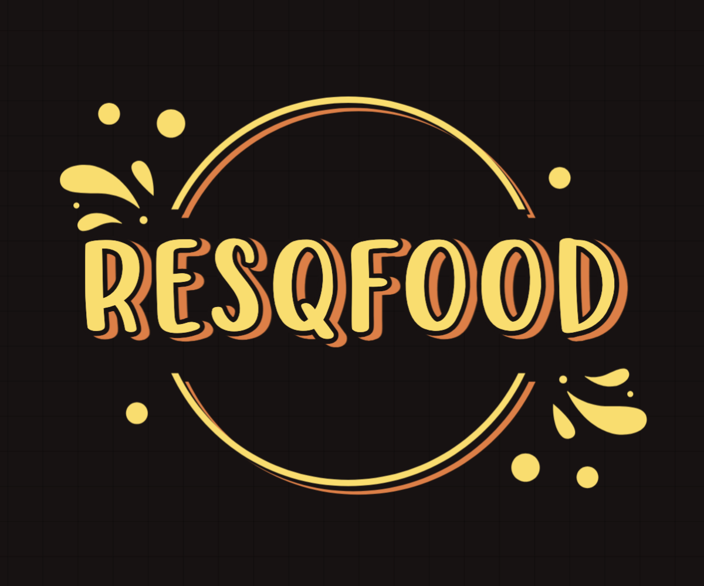

# ResQFood



## LEARN ABOUT ResQFood

## Technologies

- **Jetpack**
  - [Compose](https://developer.android.com/jetpack/compose): Modern toolkit for building native UI.
  - [Navigation](https://developer.android.com/jetpack/compose/navigation): Navigation component for Jetpack Compose.
  - [ViewModel](https://developer.android.com/topic/libraries/architecture/viewmodel): Store UI-related data that isn't destroyed on UI changes.
  - [Room](https://developer.android.com/jetpack/androidx/releases/room): SQLite object mapping library.
  - [Paging 3](https://developer.android.com/topic/libraries/architecture/paging/v3-overview): Load and display small chunks of data at a time.
- **Hilt**: Dependency injection library for Android.
- **Retrofit**: Type-safe HTTP client for Android and Java.
- **Coroutines**: For managing background threads with simplified code and reducing needs for callbacks, with [Flow](https://kotlinlang.org/docs/flow.html).
- **Coil**: Image loading library for Android backed by Kotlin Coroutines.
- **Gson**: A Java serialization/deserialization library to convert Java Objects into JSON and back.

## Architecture

ResQFood follows the MVVM (Model-View-ViewModel) architecture pattern, which separates the presentation layer from the business logic and data handling. This architecture pattern helps to create a modular, scalable, and testable codebase.

## Get Started

- To get started with ResQFood, follow these steps:
1. Give a star to this repository.
2. Fork this repository.
3. Clone the forked repository to your local machine by typing the following command in the terminal
```
$ git clone https://github.com/<your-github-username>/ResQFood.git
```
4. Change directory
```
$ cd ResQFood
```
5. Add a reference(remote) to the original repository.
```
$ git remote add upstream https://github.com/repository_owner/repository_name.git
```
6. Check the remotes for this repository.
```
$ git remote -v
```
7. Make a pull from the upstream repository to your main branch to keep it updated as per the main project repository.
```
$ git pull upstream main
```
8. Create a new branch for your changes.
```
$ git checkout -b <YOUR_BRANCH_NAME>
```
9. Make your changes in the code.
10. After making the required changes. Check your changes with
```sh
$ git status
$ git diff
```
11. Stage your changes
```
$ git add . <\files_that_you_made_changes>
```
12. Commit your changes.
```
$ git commit -m "relavant message"
```
13. Push your changes to your forked repository.
```
$ git push -u origin <your_branch_name>
```
14. Now to create a pull request, click on compare and pull request.
15. Add an appropriate title and description to your PR explaining your changes.
16. Click on Create pull request.

## Contributing

We welcome contributions from the community to help improve and expand ResQFood. Whether you're a developer, designer, or passionate about our cause, we'd love to have you on board!

## Support

If you have any questions, feedback, or need assistance, feel free to reach out to us at the discussion panel. We're here to help!

## License

ResQFood is licensed under the [MIT License](LICENSE).
